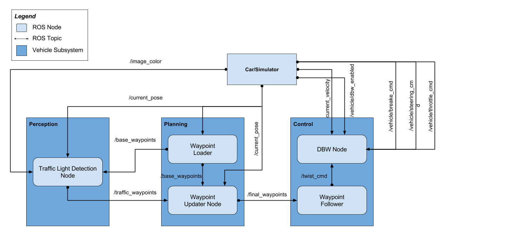

# Udacity Self-Driving Car Nanodegree Capstone: Programming a Real Self-Driving Car

## Introduction
During this Nanodegree we learned about different aspects of Self Driving Car/Autonomous technologies like Deep Learning, Computer Vision, Sensor Fusion, Localization, Controllers & Path Planning. The goal of this project is to use 3 aspects(Perception, Path Planning and Controls) and make a simulated car drive autonomously around a simulated track. Then, also on a real track on a real car obeying speed limits and traffic light rules. 

This is the project repo for the final project of the Udacity Self-Driving Car Nanodegree: Programming a Real Self-Driving Car by:

* [Anand Dinakar(ananddinakar@gmail.com)](https://github.com/cygnus77)
* [Dan Bergeland(danbergeland@gmail.com)](https://github.com/danbergeland)
* [Doug Brummel(doug.brummell@gmail.com)](https://github.com/d13sl0w) (team lead)
* [Monish Sunku Prabhakar(sunku.monish@colorado.edu)](https://github.com/spgitmonish)

## Overview 
For this project, we wrote ROS nodes to implement core functionality of the autonomous vehicle system, including traffic light detection, waypoint following and control. The following is a system architecture diagram showing the ROS nodes and topics used in the project. 

<p align="center">
   
</p>
<p align="center">
   <i>Figure 1: Project Architecture</i>
</p>

### Perception
This module is responsible for detecting the color of the traffic light in sight and publish the closest way(index of the) point to the light if the light color is Red or Yellow. The traffic light detection node subscribes to three topics in order to publish the necessary result to */traffic_waypoints*:

1. */base_waypoints*: Provides the complete list of waypoints for the course.
2. */current_pose*: Used to determine the vehicle's location.
3. */image_color*: Provides an image stream from the car's camera. These images are used to determine the color of upcoming traffic lights.

We used the Inception-V3 model for training on an images dataset and for inference in real-time.

> **NOTE**: We as a team experimented with SqueezeNet, VGG16 as well as YOLO(required external libraries) as models for perception but decided to use Inception-V3 as the final model for inference.  

<p align="center">
   
</p>
<p align="center">
   <i>Figure 2: Perception</i>
</p>

`Code: ../ros/src/tl_detector.py, ../ros/src/tl_detector/light_classifier/tl_classifier.py`

### Planning
This module subscribes to */current_pose* to get the current position of the car and */traffic_waypoints* topic to get the closest waypoint to the upcoming traffic light to stop at, if the light color is Red or Yellow. The messages from these two topics and the values in the messages determine the next state in the state machine within this module which in turn determines the target velocities for the upcoming waypoints. 

The Waypoint Loader node of this module publishes to the */base_waypoints*  topic a list of all waypoints for the track, so this list includes waypoints both before and after the vehicle(published only once). The second topic this module publishes to, */final_waypoints*, is the list of fixed number of waypoints currently ahead of the vehicle. The first waypoint in the list published to */final_waypoints* should be the first waypoint that is currently ahead of the car.

<p align="center">
   
</p>
<p align="center">
   <i>Figure 3: Planning</i>
</p>

`Code: ../ros/src/waypoint_updater/waypoint_updater.py`

### Control
Once messages are published to */final_waypoints*, the vehicle's waypoint follower will publish twist commands to the */twist_cmd* topic. The drive-by-wire node, which subscribes to */twist_cmd*, uses various controllers to provide appropriate throttle, brake, and steering control commands. These commands are then be published to the following topics respectively:

1. */vehicle/throttle_cmd*
2. */vehicle/brake_cmd*
3. */vehicle/steering_cmd*

This module subscribes to the */vehicle/dbw_enabled* topic because a safety driver may take control of the car during testing, and it's not assumed that the car is always following the commands. If a safety driver does take over, the controller will mistakenly accumulate error. In the simulator, DBW is always enabled but not in the actual car.

<p align="center">
   
</p>
<p align="center">
   <i>Figure 4: Control</i>
</p>

`Code: ../ros/src/twist_controller/`

## Setup
### Installation 

* Be sure that your workstation is running Ubuntu 16.04 Xenial Xerus or Ubuntu 14.04 Trusty Tahir. [Ubuntu downloads can be found here](https://www.ubuntu.com/download/desktop). 
* If using a Virtual Machine to install Ubuntu, use the following configuration as minimum:
  * 2 CPU
  * 2 GB system memory
  * 25 GB of free hard drive space
  
  The Udacity provided virtual machine has ROS and Dataspeed DBW already installed, so you can skip the next two steps if you are using this.

* Follow these instructions to install ROS
  * [ROS Kinetic](http://wiki.ros.org/kinetic/Installation/Ubuntu) if you have Ubuntu 16.04.
  * [ROS Indigo](http://wiki.ros.org/indigo/Installation/Ubuntu) if you have Ubuntu 14.04.
* [Dataspeed DBW](https://bitbucket.org/DataspeedInc/dbw_mkz_ros)
  * Use this option to install the SDK on a workstation that already has ROS installed: [One Line SDK Install (binary)](https://bitbucket.org/DataspeedInc/dbw_mkz_ros/src/81e63fcc335d7b64139d7482017d6a97b405e250/ROS_SETUP.md?fileviewer=file-view-default)
* Download the [Udacity Simulator](https://github.com/udacity/CarND-Capstone/releases/tag/v1.2).

### Usage

1. Clone the project repository
```bash
git clone https://github.com/udacity/CarND-Capstone.git
```
2. Install python dependencies
```bash
cd CarND-Capstone
pip install -r requirements.txt
```
3. Make and run styx
```bash
cd ros
catkin_make
source devel/setup.sh
roslaunch launch/styx.launch
```
4. Run the simulator

### Run Tests locally

To run the tests, do 'catkin_make' and 'source devel/setup.bash' in the ros directory.  Go to the build folder with 'cd build'. From /ros/build use the command 'make run_tests' and it goes and runs all the unit tests!  It takes some doing to connect the test files with the build system, but now that I have the first couple done, you can use them as an example to add more tests.  You need to add rostest to package.xml as a build dependency.  You need to create a test file xml that has similar xml tags as the .launch files, except the all-important /test\ tag that points the build system to the test file.  Then the unit test files themselves need some rostest functions, but you can look at the twist_controller_test.py file for those.

### Real world testing

1. Download [training bag](https://drive.google.com/file/d/0B2_h37bMVw3iYkdJTlRSUlJIamM/view?usp=sharing) that was recorded on the Udacity self-driving car
2. Unzip the file
```bash
unzip traffic_light_bag_files.zip
```
3. Play the bag file
```bash
rosbag play -l traffic_light_bag_files/loop_with_traffic_light.bag
```
4. Launch your project in site mode
```bash
cd CarND-Capstone/ros
roslaunch launch/site.launch
```

## Final Thoughts
This project is the culmination of almost 12 months of learning. Our team included members from 3 different regions and time-zones of the country. It was really gratifying to design and develop the modules and ensure that the different pieces work together to have a safe, compliant and working solution.
